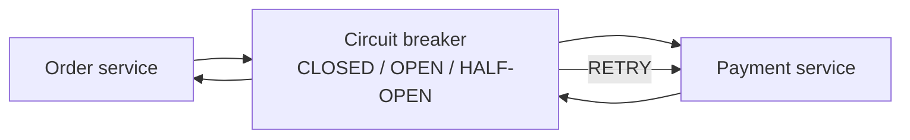
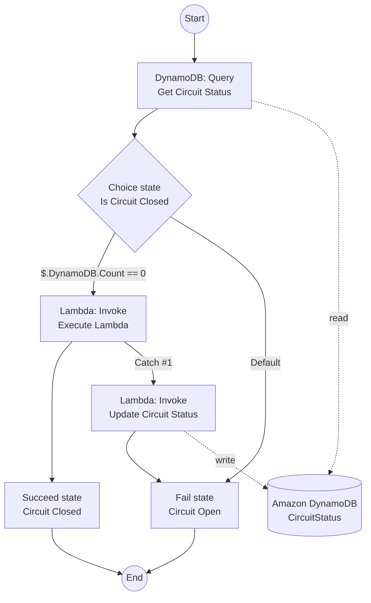

# 如何在 AWS 上實作斷路器（Circuit Breaker）模式？

## Abstract

- 以「斷路器」在呼叫方與被呼叫服務之間做保護層：超時/失敗過多就快速失敗（fail fast），避免持續打爆下游。 [[#^ref-open-threshold|1]] [[#^ref-immediate-failure|2]]
- 以狀態（OPEN/CLOSED）+「到期」的方式管理電路狀態，並以 DynamoDB TTL 自動清理過期狀態。 [[#^ref-open-unexpired|7]] [[#^ref-ttl-delete|8]]
- AWS 參考實作：Step Functions（Express Workflows）編排 + Lambda 執行 + DynamoDB/ElastiCache 儲存電路狀態。 [[#^ref-sfn-express|4]] [[#^ref-ddb-store|5]] [[#^ref-elasticache-replace|9]]

## Purposes

1. **降低連鎖故障（Cascading Failure）風險**：當下游服務已不健康時，讓呼叫方「立即失敗」而不是繼續等待/重試造成雪崩。 [[#^ref-immediate-failure|2]]
2. **用可控的方式試探恢復**：以「未過期記錄代表 OPEN」的策略控流，並透過 TTL 自動讓狀態可被重新評估。 [[#^ref-open-unexpired|7]] [[#^ref-ttl-delete|8]]
3. **把韌性策略外顯化**：在工作流中明確表達「OPEN 就走 Circuit Open 分支」的決策路徑，讓行為可讀、可測。 [[#^ref-asl-open-branch|12]]

## When to Use

- 呼叫方依賴下游服務（例如訂單 → 支付），且下游偶發超時/失敗會拖垮上游資源（執行緒、連線池、併發）。 [[#^ref-open-threshold|1]]
- 你希望在失敗時採用「重試 + 指數退避」但仍要有上限與保護機制。 [[#^ref-exp-backoff|10]]

## How It Works

1. **呼叫方 → 斷路器 → 下游服務**：當超時超過門檻，電路會被打開。 [[#^ref-open-threshold|1]]
2. **OPEN 時快速失敗**：呼叫方呼叫下游時直接回傳失敗（不再轉發到故障服務）。 [[#^ref-immediate-failure|2]]
3. **成功則關閉**：當下游呼叫成功，電路會關閉（回到正常轉發）。 [[#^ref-closed-on-success|3]]

## Implementation Notes (AWS)

- **Workflow orchestration**：用 **AWS Step Functions（Express Workflows）** 編排斷路器流程。 [[#^ref-sfn-express|4]]
- **Circuit state store**：用 **Amazon DynamoDB** 的 `CircuitStatus` 表追蹤電路狀態。 [[#^ref-ddb-store|5]] [[#^ref-get-status-from-table|6]]
  - `CircuitStatus` 有「未過期記錄」代表電路為 OPEN。 [[#^ref-open-unexpired|7]]
  - 用 **DynamoDB TTL** 自動刪除過期狀態（作為恢復檢測的一部分）。 [[#^ref-ttl-delete|8]]
  - 若更在意效能，可改用 **Amazon ElastiCache (Redis OSS)** 作為 in-memory 狀態儲存。 [[#^ref-elasticache-replace|9]]
- **Compute**：以 **AWS Lambda** 實作檢查/執行步驟（例如 `GetCircuitStatus` 用來檢查狀態）。 [[#^ref-getcircuitstatus-lambda|11]]
- **Control flow**：在 Step Functions 的 Amazon States Language 中以 `$.CircuitStatus == "OPEN"` 分支到「Circuit Open」。 [[#^ref-asl-open-branch|12]]
- **Retry policy（此頁面範圍內有提及）**：失敗或超時時採用「指數退避」重試固定次數。 [[#^ref-exp-backoff|10]]
- **Observability / admin override**：本筆記依據的頁面範圍（pp. 21–25）未涵蓋「logging/可觀測性」與「管理員手動強制開/關」的具體做法（文件指出在其他頁）。 

## References

1. "If the timeouts exceed a specified threshold, the application opens the circuit." (aws-cloud-design-patterns.pdf, p. 21) ^ref-open-threshold
2. "It returns an immediate failure when the order service calls the payment service." (aws-cloud-design-patterns.pdf, p. 21) ^ref-immediate-failure
3. "When the call to payment service succeeds, the circuit is closed..." (aws-cloud-design-patterns.pdf, p. 21) ^ref-closed-on-success
4. "The sample solution uses express workflows in AWS Step Functions to implement the circuit breaker pattern." (aws-cloud-design-patterns.pdf, p. 22) ^ref-sfn-express
5. "The solution also uses an Amazon DynamoDB table as the data store to track the circuit status." (aws-cloud-design-patterns.pdf, p. 22) ^ref-ddb-store
6. "The workflow gets the circuit breaker status from the DynamoDB CircuitStatus table..." (aws-cloud-design-patterns.pdf, p. 22) ^ref-get-status-from-table
7. "If CircuitStatus contains an unexpired record for the callee, the circuit is open." (aws-cloud-design-patterns.pdf, p. 22) ^ref-open-unexpired
8. "Expired items are deleted from the CircuitStatus table by using the DynamoDB time to live (TTL) feature." (aws-cloud-design-patterns.pdf, p. 22) ^ref-ttl-delete
9. "This can be replaced with an in-memory datastore such as Amazon ElastiCache (Redis OSS) for better performance." (aws-cloud-design-patterns.pdf, p. 22) ^ref-elasticache-replace
10. "If the service call fails or a timeout occurs, the application retries with exponential backoff for a defined number of times." (aws-cloud-design-patterns.pdf, p. 22) ^ref-exp-backoff
11. "The following code uses the GetCircuitStatus Lambda function to check the circuit breaker status." (aws-cloud-design-patterns.pdf, p. 23) ^ref-getcircuitstatus-lambda
12. "\"Variable\": \"$.CircuitStatus\", \"StringEquals\": \"OPEN\", \"Next\": \"Circuit Open\"" (aws-cloud-design-patterns.pdf, p. 23) ^ref-asl-open-branch
13. "For a complete implementation of the sample architecture for this pattern, see the GitHub repository at..." (aws-cloud-design-patterns.pdf, p. 24) ^ref-github-repo
14. "Using the circuit breaker pattern with AWS Step Functions and Amazon DynamoDB" (aws-cloud-design-patterns.pdf, p. 25) ^ref-aws-blog-ref
15. "Related content ... Strangler fig pattern ... Retry with backoff pattern" (aws-cloud-design-patterns.pdf, p. 25) ^ref-related-content
