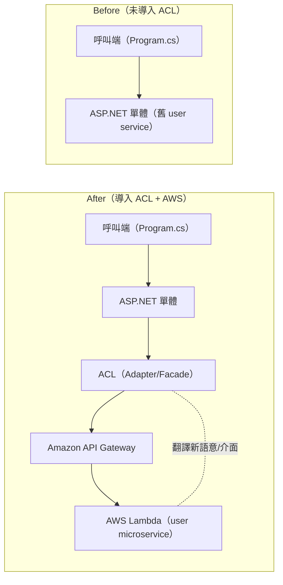

# 如何在 AWS 上實作 ACL（Anti-Corruption Layer）模式？

## 摘要

- 遷移痛點：服務遷出後，新介面很可能不再與單體內原介面一致。[[#^ref-interface-mismatch|7]]
- 解法核心：在邊界引入 ACL 作為中介層，負責語意/模型翻譯，讓單體維持原本的呼叫方式。[[#^ref-mediation|1]] [[#^ref-adapter-facade|3]]
- AWS 範例流程：ACL 翻譯後，透過 API Gateway 呼叫部署在 Lambda 的微服務。[[#^ref-translate-via-apigw|10]] [[#^ref-apigw|9]] [[#^ref-lambda|8]]

## 目的

1. **降低轉型風險 / 減少業務中斷**：即使需要透明重導向呼叫，也盡量不改呼叫端。[[#^ref-reduce-risk|4]]
2. **解耦呼叫端與新服務語意**：透過翻譯呼叫，避免呼叫端在現有系統中修改。[[#^ref-decouple|5]]
3. **跨 bounded context 翻譯模型**：在邊界把單體模型轉成微服務適用的模型。[[#^ref-bounded-context|2]]

## 運作方式

- **邊界中介**：在單體與遷移後服務之間放置 ACL，負責語意/模型翻譯。[[#^ref-mediation|1]]
- **透明呼叫**：ACL 作為 Adapter/Facade，讓單體不用改呼叫方式就能呼叫微服務。[[#^ref-adapter-facade|3]]
- **落地翻譯**：以物件轉換實作翻譯（來源物件 → 新介面 → 呼叫 → 回傳）。[[#^ref-convert-source-object|12]]
- **放置選擇**：ACL 可在單體內以類別形式實作，或獨立成服務。[[#^ref-placement|6]]
- **生命週期**：依賴服務遷移完成後，ACL 必須拆除。[[#^ref-decommission|13]]

## 實作筆記（AWS）

### 放置位置

- ACL 可在單體內以類別形式實作，或作為獨立服務。[[#^ref-placement|6]]

### 請求流程

1. 將 user microservice 從 ASP.NET 單體遷出，部署為 AWS Lambda。[[#^ref-lambda|8]]
2. 透過 Amazon API Gateway 將呼叫路由到 Lambda。[[#^ref-apigw|9]]
3. 在 ACL 內把來源物件轉成新服務介面需要的資料形狀，呼叫服務並回傳結果。[[#^ref-convert-source-object|12]]
4. ACL 轉換新語意/介面，並透過 API Gateway 端點呼叫微服務。[[#^ref-translate-via-apigw|10]]
5. 讓呼叫端（例如 Program.cs）對翻譯與路由過程無感。[[#^ref-caller-unaware|11]]

### 範例程式碼

- 需要完整範例架構與程式碼時，可參考官方 GitHub repository。[[#^ref-sample-repo|14]]

## 系統圖

## References

1. "The anti-corruption layer (ACL) pattern acts as a mediation layer that translates domain model semantics from one system to another system." (aws-cloud-design-patterns.pdf, p. 3) ^ref-mediation
2. "It translates the model of the upstream bounded context (monolith) into a model that suits the downstream bounded context (microservice) before consuming the communication contract that's established by the upstream team." (aws-cloud-design-patterns.pdf, p. 3) ^ref-bounded-context
3. "The ACL pattern allows the monolith to call the microservices transparently by acting as an adapter or a facade layer that translates the calls into the newer semantics." (aws-cloud-design-patterns.pdf, p. 3) ^ref-adapter-facade
4. "It also reduces transformation risk and business disruption by preventing changes to callers when their calls have to be redirected transparently to the target system." (aws-cloud-design-patterns.pdf, p. 3) ^ref-reduce-risk
5. "ACL decouples the callees and translates the calls to match the semantics of the new services, thus avoiding the need for callers to make changes in the current system." (aws-cloud-design-patterns.pdf, p. 4) ^ref-decouple
6. "You can implement ACL inside your monolithic application as a class that's specific to the service that's being migrated, or as an independent service." (aws-cloud-design-patterns.pdf, p. 5) ^ref-placement
7. "It's also likely that the interface of the newly migrated service won't match its previous interface, when it was inside the monolithic application." (aws-cloud-design-patterns.pdf, p. 5) ^ref-interface-mismatch
8. "The user microservice is migrated out of the ASP.NET monolithic application and deployed as an AWS Lambda function on AWS." (aws-cloud-design-patterns.pdf, p. 6) ^ref-lambda
9. "Calls to the Lambda function are routed through Amazon API Gateway." (aws-cloud-design-patterns.pdf, p. 6) ^ref-apigw
10. "The ACL translates the call to the new semantics and interface, and calls the microservice through the API Gateway endpoint." (aws-cloud-design-patterns.pdf, p. 6) ^ref-translate-via-apigw
11. "The caller (Program.cs) isn't aware of the translation and routing that take place in the user service and ACL." (aws-cloud-design-patterns.pdf, p. 6) ^ref-caller-unaware
12. "The ACL converts the source object to match the interface of the newly migrated service, calls the service, and returns the response to the caller." (aws-cloud-design-patterns.pdf, p. 7) ^ref-convert-source-object
13. "The anti-corruption layer must be decommissioned after all dependent services have been migrated into the microservices architecture." (aws-cloud-design-patterns.pdf, p. 6) ^ref-decommission
14. "For a complete implementation of the sample architecture for this pattern, see the GitHub repository at https://github.com/aws-samples/anti-corruption-layer-pattern." (aws-cloud-design-patterns.pdf, p. 8) ^ref-sample-repo
